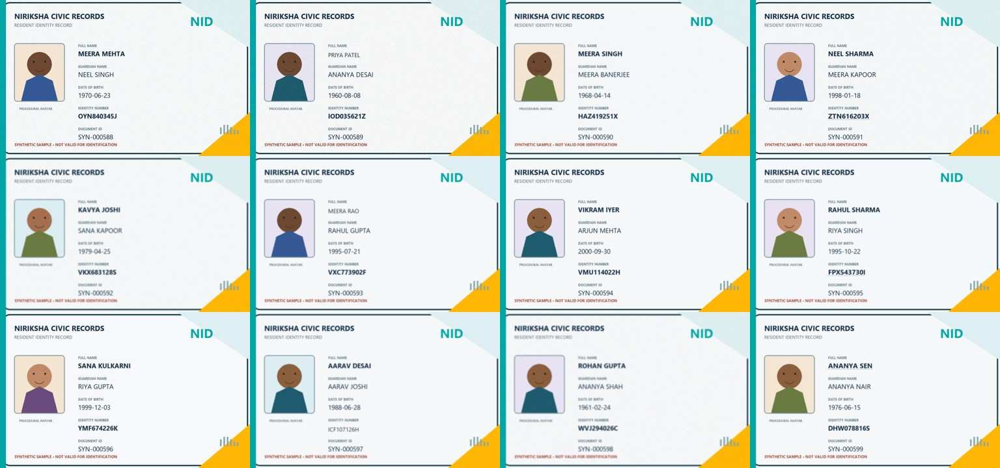
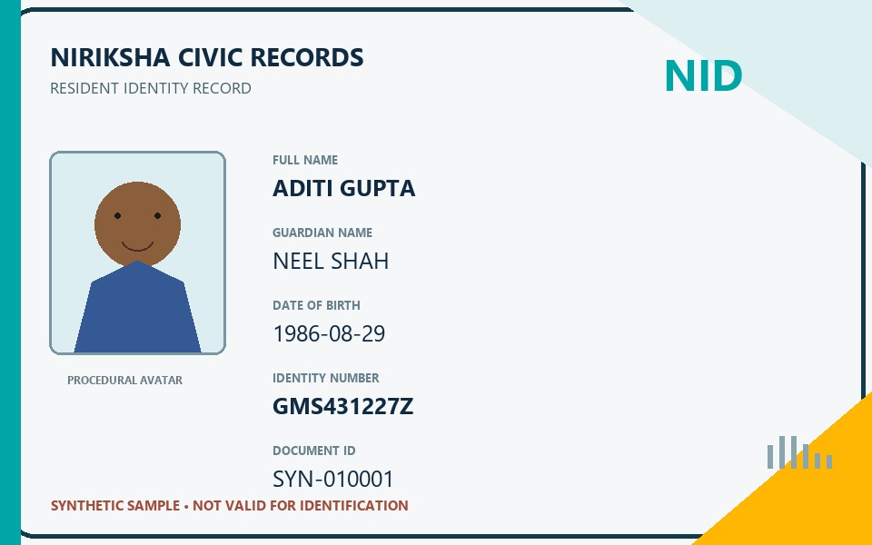
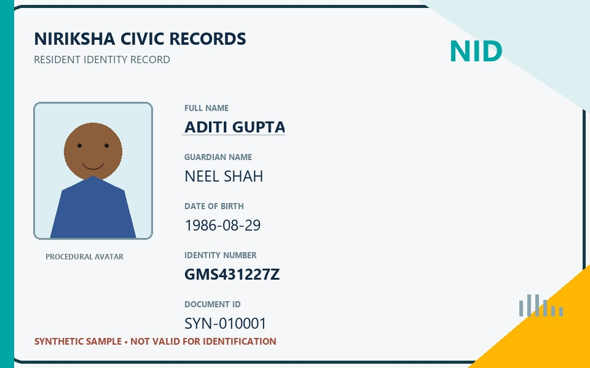
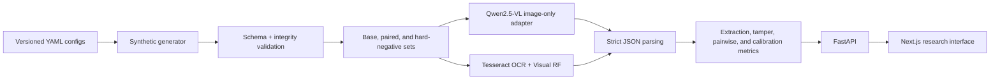

<div align="center">

# NirikshaID Bench

**A reproducible synthetic benchmark for document extraction, tamper detection, counterfactual sensitivity, hard-negative robustness, and uncertainty calibration.**

[](https://www.python.org/)
[](https://nextjs.org/)
[](https://fastapi.tiangolo.com/)
[](.github/workflows/ci.yml)
[](LICENSE)


</div>



## Why this exists

Real identity-document datasets are difficult to release because they contain sensitive personal data. NirikshaID Bench provides a controlled alternative for studying:

- structured field extraction;
- tamper detection and tamper-type classification;
- localization of manipulated regions;
- blur, noise, and JPEG robustness;
- held-out tamper generalization;
- counterfactual intervention sensitivity;
- genuine hard-negative false positives;
- calibration, abstention, and selective manual review.

The benchmark uses one original fictional card design, procedural avatars, synthetic identities, and no official marks, seals, signatures, QR codes, or government-document layouts.

## What makes it more than an OCR demo

The central question is not only _“Can the text be read?”_ It is also:

> Does the model react to the manipulation itself, or merely to an unusual-looking image region?

NirikshaID Bench tests that distinction with exact counterfactual pairs and suspicious-looking genuine documents.

| Diagnostic | Design |
|---|---|
| Base benchmark | 600 deterministic synthetic documents |
| Held-out generalization | `digit_edit` excluded from train/validation |
| Counterfactual set | 30 genuine/tampered pairs sharing identity, layout, avatar, and degradation |
| Hard negatives | 40 genuine documents with eight suspicious but legitimate rendering conditions |
| Models | Qwen2.5-VL-3B-Instruct and template-aware Tesseract OCR + visual RF |
| Uncertainty | ECE, Brier score, reliability bins, risk–coverage, selective accuracy |

## Measured results

These are locally measured results saved under [`data/results`](data/results) and [`data/diagnostics/results`](data/diagnostics/results). The base model runs contain 20 samples per split and should be treated as diagnostic estimates, not population-level claims.

### Image-only model comparison

| System | Split | Samples | Field NEM | Tamper F1 | Type macro F1 | Parse success |
|---|---:|---:|---:|---:|---:|---:|
| Qwen2.5-VL-3B, Q4_K_M | `eval_seen` | 20 | **98.0%** | 0.0% | 22.2% | 100% |
| Qwen2.5-VL-3B, Q4_K_M | `eval_unseen` | 20 | **99.0%** | 0.0% | 31.0% | 100% |
| Tesseract OCR + Visual RF | `eval_seen` | 20 | 93.0% | **82.4%** | **72.2%** | 100% |
| Tesseract OCR + Visual RF | `eval_unseen` | 20 | **100%** | **82.4%** | 25.6% | 100% |

Qwen transcribed the fixed synthetic layout accurately but classified nearly every sample as genuine. This is a useful negative result: strong extraction does not imply reliable forgery reasoning. The OCR/RF system detected seen manipulations more effectively but failed the held-out digit-edit classification test.

### Hard-negative and paired diagnostics

| Finding | Measured value |
|---|---:|
| Hard-negative false-positive rate | **42.5%** — 40 genuine samples |
| Tamper F1 before hard negatives | 82.4% |
| Tamper F1 after hard negatives | **41.2%** |
| Correct verdict flips | **46.7%** — 30 counterfactual pairs |
| Font-swap correct flips | 80% — 10 pairs |
| Digit-edit correct flips | 60% — 10 pairs |
| Copy/paste-splice correct flips | **0%** — 10 pairs |
| Expected Calibration Error | 0.053 — 120 decisions |
| Brier score | 0.205 — 120 decisions |
| Errors avoided at 20% review rate | 10 |

Legitimate font and kerning variation produced 100% false-positive rates in the hard-negative diagnostic. That result suggests the visual classifier often recognizes rendering inconsistency rather than manipulation itself.

## Counterfactual design

The genuine and tampered branches start from the same rendered card. Both replay the same degradation seed; only the tamper intervention differs.

| Genuine source | Tampered intervention |
|---|---|
|  |  |

This isolates the causal effect of the tamper from names, avatars, layout, and image quality.

## Architecture



The prediction boundary accepts only an image path. Labels are introduced afterward for scoring. The label-derived gallery adapter is explicitly named **Demo Stub**, is not selectable by the evaluator, and is excluded from benchmark summaries.

## Repository layout

```text
configs/                       Dataset, model, evaluation, and diagnostic configs
data/                          Compact validation and result artifacts
docs/                          Architecture, methodology, cards, limitations, deployment
frontend/                      Next.js research interface
scripts/                       Reproducible CLI entry points
src/niriksha_bench/
  api/                         FastAPI routes
  evaluation/                  Metrics, evaluator, calibration, failure analysis
  generator/                   Rendering, tampers, degradation, diagnostics
  models/                      Qwen, OCR, Gemini, parser, Demo Stub
  training/                    Leakage-safe optional QLoRA preparation
tests/                         Unit, API, integrity, and integration tests
```

Large generated images, per-document labels, model weights, and raw prediction logs are intentionally excluded from Git. They are regenerated locally from versioned configs and seeds.

## Quick start

### Prerequisites

- Python 3.11 or 3.12
- Node.js 20+
- Tesseract 5.x for the classical OCR baseline
- Optional: [Ollama](https://ollama.com/) for local Qwen inference

### Windows

```powershell
python -m venv .venv
.\.venv\Scripts\Activate.ps1
python -m pip install -e ".[eval,dev,ocr]"

cd frontend
npm install
cd ..

python scripts/generate_dataset.py --config configs/dataset.yaml --clean
python scripts/generate_diagnostics.py
python scripts/run_local.py
```

### Unix

```bash
python -m venv .venv
. .venv/bin/activate
python -m pip install -e '.[eval,dev,ocr]'

(cd frontend && npm install)

python scripts/generate_dataset.py --config configs/dataset.yaml --clean
python scripts/generate_diagnostics.py
python scripts/run_local.py
```

Open:

- Frontend: `http://localhost:3000`
- API: `http://localhost:8000`
- OpenAPI docs: `http://localhost:8000/docs`

## Reproduce the experiments

### Generate and validate

```bash
python scripts/generate_dataset.py --config configs/dataset.yaml --clean
python scripts/validate_dataset.py

python scripts/generate_diagnostics.py
python scripts/validate_diagnostics.py
```

### Classical baseline

```bash
python scripts/run_benchmark.py --model ocr --split eval_seen --limit 20
python scripts/run_benchmark.py --model ocr --split eval_unseen --limit 20
python scripts/run_diagnostics.py
```

### Qwen2.5-VL-3B

```bash
ollama pull qwen2.5vl:3b
python scripts/run_benchmark.py --model qwen --split eval_seen --limit 20
python scripts/run_benchmark.py --model qwen --split eval_unseen --limit 20
```

The recorded Qwen runs used Ollama Q4_K_M, prompt `niriksha-v2`, temperature `0`, and CPU inference. Median latency was approximately three minutes per image on the development machine.

## Tests

```bash
python -m pytest
python -m ruff check --no-cache src tests scripts

cd frontend
npm run lint
npm run build
```

The complete local test suite currently contains 21 passing tests. GitHub CI skips tests that require regenerated local image artifacts.

## API surface

Key routes include:

- `GET /api/health`
- `GET /api/project`
- `GET /api/dataset/stats`
- `GET /api/benchmark/summary`
- `GET /api/benchmark/failures`
- `GET /api/diagnostics/summary`
- `GET /api/diagnostics/pairs`
- `GET /api/diagnostics/hard-negatives`
- `GET /api/demo/gallery`
- `POST /api/demo/analyze`

## Reproducibility and leakage controls

- Every generated record stores a deterministic seed and generator version.
- Pydantic validates labels, tamper state, field formats, and held-out split rules.
- The dataset validator checks images, bounding boxes, class balance, and leakage.
- `digit_edit` is rejected from train and validation.
- Qwen receives image bytes and one common prompt—never labels or generator metadata.
- Tesseract reads fixed image regions; its visual classifier is fit only on permitted training images and labels.
- Raw parser failures remain failures.
- Model, prompt, quantization, split, sample count, latency, and timestamp are recorded.

## Limitations

- One synthetic layout and English-only text.
- Small 20-sample model diagnostics.
- Synthetic-to-real domain gap.
- Fixed-region OCR benefits from template knowledge.
- Procedural avatars do not model portrait attacks.
- Limited tamper and capture taxonomy.
- No production-security or fraud-detection claim.
- Model explanations may not reflect causal reasoning.

See [docs/limitations.md](docs/limitations.md) for the full discussion.

## Ethical safeguards

This project does not use real identity documents or scraped portraits. Generated cards are visibly marked synthetic and invalid for identification. Do not contribute real personal data, official document replicas, government marks, signatures, seals, or credentials.

## Documentation

- [Architecture](docs/architecture.md)
- [Methodology](docs/methodology.md)
- [Dataset card](docs/dataset_card.md)
- [Model card](docs/model_card.md)
- [Limitations](docs/limitations.md)
- [Deployment](docs/deployment.md)
- [Contributing](CONTRIBUTING.md)
- [GitHub release checklist](docs/github-release-checklist.md)

## Author

**Ninad Naik**  
CS Student · AI/ML Research and Engineering

[GitHub](https://github.com/ninadnaik03) · [LinkedIn](https://www.linkedin.com/in/ninad-naik-274883262/)

---

Built as a research-engineering demonstration. Licensed under the [MIT License](LICENSE).
